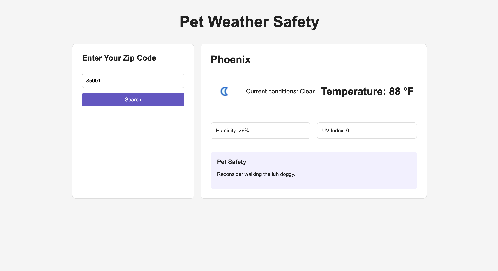

# Pet Weather Safety

A weather safety tool for pet owners built using HTML, CSS, and JavaScript.

## About

This application allows users to enter their location and check current weather conditions to determine whether it is safe for their pet to be outside. The project connects two APIs, using data from one API to make a request to another and display relevant results to the user.

## Screenshot

## Built With

- HTML
- CSS
- JavaScript
- Weather API
- Location API

## What I Practiced

- Connecting multiple APIs
- Using data from one API in another API request
- Fetching data with `fetch()`
- Working with JSON data
- DOM manipulation
- Handling user input
- Displaying API results on the page